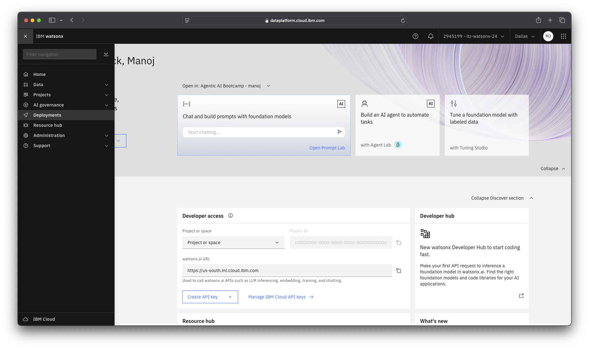
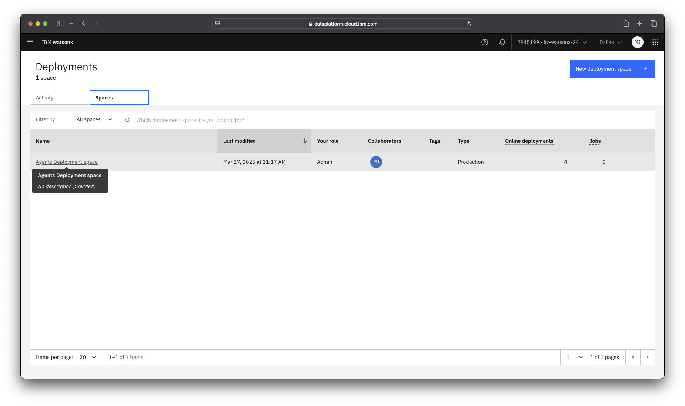
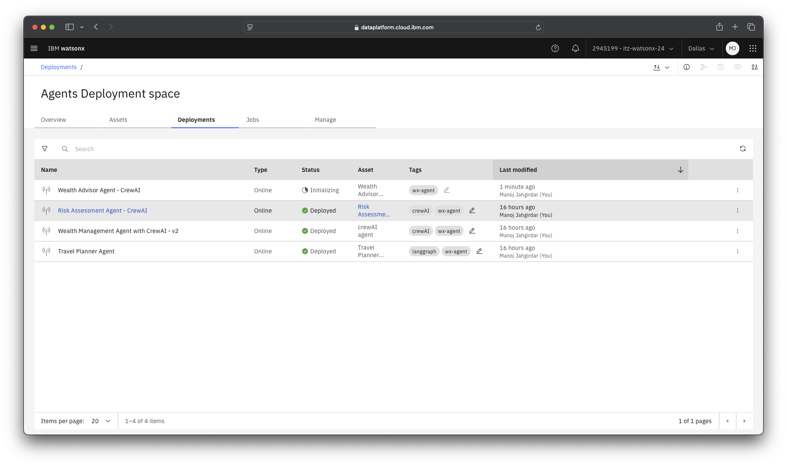
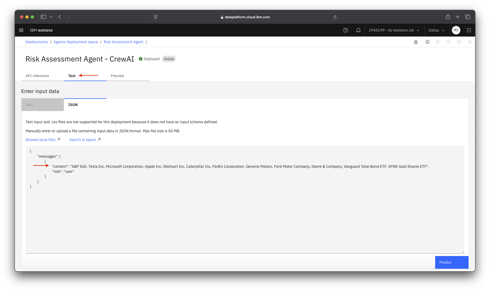
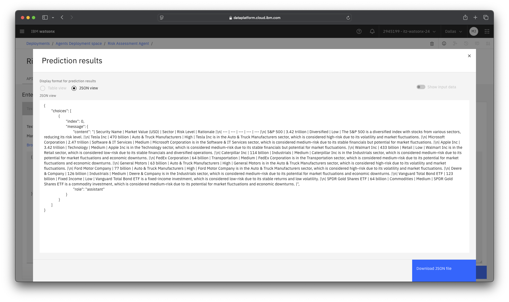
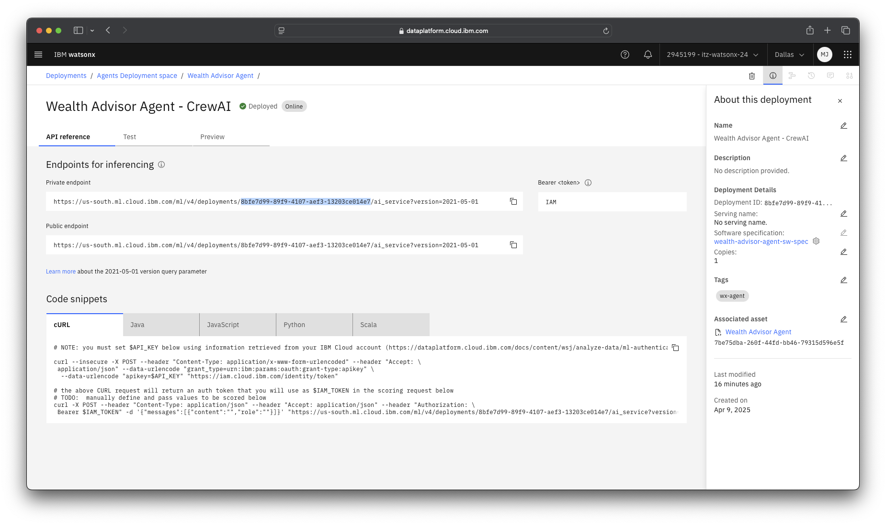
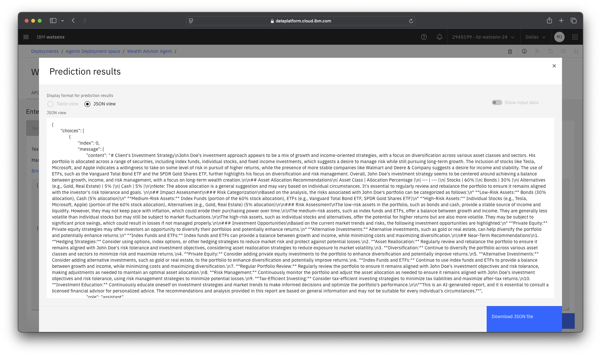

# Build and Deploy a risk assessment and wealth advisor agents with watsonx.ai SDKs

!!! warning "Draft version"
    
    Work in progress!

!!! info "Agentic AI Framework Details"

    - **Framework**: CrewAI
    - **Foundation Model**: meta-llama/llama-3-3-70b-instruct

## Use case

### Wealth management agent - Risk assessment agent

The Portfolio Risk Assessment Agent supports financial advisors by evaluating investment portfolios for potential risk exposures. It reviews each asset in the portfolio based on factors like market value concentration, sector distribution, volatility, and overall diversification, delivering a detailed and actionable risk profile.

Key Features:

- Risk Evaluation per Asset: Assesses each security in the portfolio and assigns a Risk Level (High, Medium, Low) based on exposure and volatility.
- Diversification & Sector Analysis: Identifies sector overconcentration and diversification gaps that may impact portfolio stability.
- Markdown Risk Report: Generates a clean, structured Markdown table summarizing each asset’s name, value, sector, risk level, and rationale for easy review and reporting.

### Wealth management agent - Wealth advisor agent


## Steps

### Clone the GitHub repo

1. We have curated the CrewAI multi-agent as part of this lab, get started by cloning the repo:

    ```
    git clone --no-tags --depth 1 --single-branch --filter=tree:0 --sparse https://github.com/IBM/EEL-agentic-ai-bootcamp.git
    cd EEL-agentic-ai-bootcamp/
    git sparse-checkout add labs/lab2/risk-assessment-agent
    git sparse-checkout add labs/lab2/wealth-advisor-agent
    ```

1. This CrewAI code is developed using the quick start [template for LLM apps building using CrewAI framework](https://www.ibm.com/watsonx/developer/agents/quickstart).

!!! info "Reference Material"
    You can learn more about the different starter kits made available by watsonx developer hub here: <https://www.ibm.com/watsonx/developer/agents/quickstart>

### Install the dependencies

1. Create a virtual environment. `uv` package manager is recommended.

    ```
    uv venv
    source .venv/bin/activate
    ```

1. Install the python dependencies.

    ```
    uv sync
    ```

#### Risk assessment agent

1. Once you have cloned the repo goto the `risk-assessment-agent` directory:

    ```
    cd labs/lab2/risk-assessment-agent
    ```

### Configure environment variables

1. In `config.toml` enter the following details:

    ```
    watsonx_apikey = " " # watsonx api key
    space_id = " " # space id
    project_id = " " # project id
    tavily_api_key = " " # tavily api key
    ```

    !!! success "Credentials"
        
        `watsonx_apikey`, `space_id` and `project_id` has been generated in Lab 1. Please use the same credentials. 
        `tavily_api_key` you can create a free Tavily API key on https://tavily.com/ or ask the instructor to provide the API key.

### Run the agent locally

1. Run the following command to test the agent locally.

    ```
    python examples/execute_ai_service_locally.py
    ```

1. Enter the input as follows:

    ```
    Here is John Doe's portfolio: S&P 500, Tesla Inc, Microsoft Corporation, Apple Inc, Walmart Inc, Caterpillar Inc, FedEx Corporation, General Motors, Ford Motor Company, Deere & Company, Vanguard Total Bond ETF, SPDR Gold Shares ETF
    ```
    
1. You wil see the Agent's reply.

### Deploy the agent to watsonx.ai

1. Now the agent is tested locally, you can deplop the agent on watsonx.ai runtime.

    ```
    python scripts/deploy.py
    ```

1. You can view the deployment by clicking on the hamburger menu in watsonx.ai platform and selecting **Deployments**.

    

1. Select the deployment space.

    

1. And you will see the deployment status over there.

    

1. Once the deployment status is **Deployed** you can click on **Risk Assessment Agent - CrewAI** to open the deployment and view details. You will see three tabs, **API reference**, **Test**, **Preview**. You can see the production ready public and private endpoints for your deployed agent. You can also see the deployment ID, save it in a notepad as it will be used lated to import this agent in watsonx Orchestrate.

    

    !!! success "Credentials to be saved"
        
        Save the **Deployment ID** as it will be used in the subsequent lab sessions.

1. Click on **Test** tab and you can test the service endpoint. Enter the following as a payload and click on **Predict**.
    - role: `user`
    - content: `Here is John Doe's portfolio: S&P 500, Tesla Inc, Microsoft Corporation, Apple Inc, Walmart Inc, Caterpillar Inc, FedEx Corporation, General Motors, Ford Motor Company, Deere & Company, Vanguard Total Bond ETF, SPDR Gold Shares ETF`

    

1. You will see the same results from the agent as a response from the service endpoint.

    

>Next steps: You will learn how to import this agent in watsonx Orchestrate in Lab 5.

#### Wealth advisor agent

Now that risk assessment agent is ready, you can follow the same steps to deploy and test the wealth advisor agent.

1. Goto `wealth-advisor-agent` directory:

    ```
    cd ../wealth-advisor-agent
    ```

1. You have already setup the virtual environemt and created the `config.toml`. Copy the `config.toml` to the `wealth-advisor-agent` directory to use the same credentials.

    ```
    cp ../risk-assessment-agent/config.toml .
    ```

1. Now you can test the wealth advisor locally by running the following command:

    ```
    python examples/execute_ai_service_locally.py
    ```

1. Enter the input as follows:

    ```
    Can you give me an advice on John Doe's portfolio
    ```
  
1. You wil see the Agent's reply.

1. Now that the agent is tested locally, you can deplop the agent on watsonx.ai runtime.

    ```
    python scripts/deploy.py
    ```

1. Once the deployment status is **Deployed** you can click on **Wealth Advisor Agent - CrewAI** to open the deployment and view details. You will see three tabs, **API reference**, **Test**, **Preview**. You can see the production ready public and private endpoints for your deployed agent. You can also see the deployment ID, save it in a notepad as it will be used lated to import this agent in watsonx Orchestrate.

    

    !!! success "Credentials to be saved"
        
        Save the **Deployment ID** as it will be used in the subsequent lab sessions.

1. Click on **Test** tab and you can test the service endpoint. Enter the following as a payload and click on **Predict**.
    - role: `user`
    - content: `Can you give me an advice on John Doe's portfolio`

    

>Next steps: You will learn how to import this agent in watsonx Orchestrate in Lab 5.